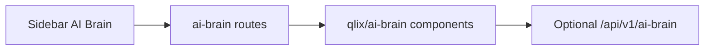

# Company AI brain — implementation plan (scoped)

## UI placement (required)

- Add a **single new primary nav item** labeled **"AI Brain"** in the dashboard sidebar for **both** individual and organization consoles.
- **Implementation surface:** all product work for the brain lives **under that menu** — dedicated App Router segment(s) and colocated components only.
- **Minimal touch elsewhere:** the only allowed cross-cutting frontend edits for this feature are what is **strictly necessary** to register the menu item and route (see [Touch surface](#allowed-touch-surface-minimal) below). **Do not** refactor or extend existing Agents, Skills, Audit, Credentials, or other pages for brain behavior unless the user explicitly expands scope later.

### Navigation wiring (when implementing)

- Extend [`frontend/src/lib/navigation/individualNav.ts`](frontend/src/lib/navigation/individualNav.ts) `getConsoleNavItems()` with one new entry, e.g. `href: \`${routePrefix}/ai-brain\``, label `AI Brain`, and an appropriate Lucide icon (e.g. `Brain`).
- [`frontend/src/components/qlix/app-sidebar.tsx`](frontend/src/components/qlix/app-sidebar.tsx) and [`frontend/src/components/qlix/mobile-drawer.tsx`](frontend/src/components/qlix/mobile-drawer.tsx) consume `getConsoleNavItems` — no structural sidebar changes expected beyond the new item.

### Routes (when implementing)

- **Individual:** [`frontend/src/app/(dashboard)/individual/ai-brain/page.tsx`](frontend/src/app/(dashboard)/individual/ai-brain/page.tsx) (and optional nested routes under `ai-brain/` only).
- **Organization:** [`frontend/src/app/(dashboard)/organization/ai-brain/page.tsx`](frontend/src/app/(dashboard)/organization/ai-brain/page.tsx) (same pattern).
- Colocate UI in something like `frontend/src/components/qlix/ai-brain/` so the feature stays isolated.

## Allowed touch surface (minimal)

| Area | Allowed |
|------|--------|
| Nav definition | Add one item in `individualNav.ts` |
| New pages | Under `.../individual/ai-brain/**` and `.../organization/ai-brain/**` only |
| New components | Under `components/qlix/ai-brain/**` (or same tree) |
| Backend (future phases) | Prefer **new** router prefix e.g. `/api/v1/ai-brain` mounted in `registerApiRoutes.ts` with **new files only**; avoid changing existing agent/chat/inference handlers unless unavoidable |
| Other dashboard pages | **Do not modify** for this initiative |

## Architecture reminder (unchanged)

Qlix remains the **governance spine** (org agents, DIDs/VCs, audit, proxy inference). The **AI Brain** product surface is the **operator and user home** for phased features (canonical brain agent, knowledge/RAG, delegation) **without** spreading UI into existing IA sections.

## Phased delivery (under AI Brain only)

1. **Shell** — Nav item + placeholder or overview page for org and individual (empty state with clear “coming soon” or phase-1 content only inside `ai-brain`).
2. **Brain agent + chat** — Wire UI to backend only from this section.
3. **Knowledge / RAG** — Admin and user flows live under `ai-brain` subroutes (e.g. `/ai-brain/sources`).

## Open decisions (unchanged)

- Product scope: L3+L5-only vs L4 connectors (see prior discussion).
- Org vs individual: same nav label; org may show extra admin tabs later **only** under `ai-brain`.

## Todos

- [ ] Add `AI Brain` to `getConsoleNavItems` with `/ai-brain` href for both prefixes
- [ ] Add `individual/ai-brain` and `organization/ai-brain` pages + isolated components
- [ ] Keep all brain-specific API/UI out of existing Agents/Skills/Audit routes
- [ ] Confirm product scope for connectors and org-only admin
