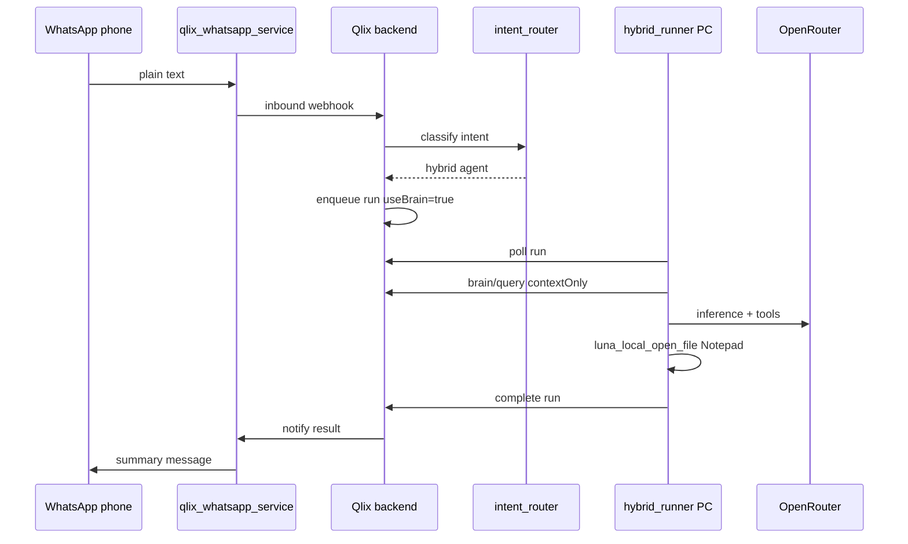

# E2E: Hybrid agent + AI Brain + WhatsApp (field support)

End-to-end use case: an officer sends a WhatsApp message; Qlix **intent routing** picks the hybrid agent, which reads company playbook from **AI Brain**, opens a log file on the **local PC**, and replies on WhatsApp when done.

## Architecture



## Prerequisites

| Service | Command / check |
|---------|-----------------|
| Postgres + backend | `cd backend && npm run dev` (port 4000) |
| Frontend | `cd frontend && npm run dev` (port 3000) |
| WhatsApp sidecar | `cd qlix-whatsapp-service && npm start` (port 3939) |
| Hybrid runner | Starter pack **Start Qlix Agent.bat** on the PC with the log files |
| Env | `OPENROUTER_API_KEY`, `QLIX_WHATSAPP_*`, `QLIX_INTERNAL_SERVICE_SECRET` in `backend/.env` |

## 1. Org AI Brain — upload playbook

1. Org workspace → **AI Brain**.
2. Create collection **`Field Support`**.
3. Upload **[field-support-log-review-playbook.md](./field-support-log-review-playbook.md)** from this repo (or paste its full contents into **Ingest document**).
4. Document title: **Field Support — Log Review Playbook**.
5. Wait until the document status is **ready** (embeddings complete). Refresh the collection list if it stays pending.

See also [docs/e2e/README.md](./README.md) for a short upload checklist.

## 2. Hybrid agent `local`

Create (or use existing) agent:

| Setting | Value |
|---------|--------|
| Runtime | **Hybrid** |
| LLM mode | **Proxy** |
| Scopes | `system.file_read`, `brain.query` (add `system.file_write` only if agents must create/save files) |
| Model | `openrouter/openai/gpt-4o-mini` (or gpt-4o for harder GUI) |
| Description | Mention field support, local PC files, and log review — this helps WhatsApp intent routing |

Download starter pack, unzip, run **Start Qlix Agent.bat**. Dashboard should show **Online** (heartbeat).

## 3. Link WhatsApp

1. **Connectors** → Link WhatsApp → scan QR.
2. Optional: set **WhatsApp default agent** to `local` (used when intent routing is uncertain).

## 4. WhatsApp test message

In **Message yourself** on the linked account:

```
#brain Follow our field support playbook. On my PC read C:\Users\admin\source\repos\autocad-final\autocad-final\bin\Debug\AgentDebug.log, open it on my screen in Notepad, list the last 5 error lines, then summarize for me here.
```

Expected:

| Step | What you see |
|------|----------------|
| Immediate reply | `Queued — local is on it. (brain on)` |
| JIT | **No approval spam** for WhatsApp runs — your message already authorizes local file access for that run |
| Your monitor | Notepad (or default app) with the log / summary file |
| ~1–3 min | WhatsApp message `📋 Qlix — local` with summary (last 5 error lines + playbook-based notes) |
| Dashboard | **Active runs** while queued/running; then agent chat activity (luna_local_read_file, luna_local_python, luna_local_open_file, …) |

**End result of the test:** Agent reads `AgentDebug.log` on your PC, extracts the last five lines containing `error` (or reports none), may write a short `error_summary.txt`, opens it in Notepad on your screen, and sends a concise field-support summary back on WhatsApp citing the playbook where relevant.

## 5. Dashboard parity (optional)

Same prompt in agent chat with **Use company brain** checked — should match WhatsApp behavior without the phone reply.

## 6. Troubleshooting

| Symptom | Fix |
|---------|-----|
| `Queued` but no WA result | WhatsApp session offline — reconnect in Connectors |
| Wrong agent picked | Improve agent descriptions; set WhatsApp default agent in Connectors |
| Numbered picker shown | Reply `1`/`2` or set a default agent |
| OFFLINE in UI | Restart hybrid runner; backend must be `localhost:4000` in `agent.json` |
| Run failed Unique constraint | Restart backend (server-side event seq fix) |
| Brain empty | Collection not ready or agent missing `brain.query`; re-upload [field-support-log-review-playbook.md](./field-support-log-review-playbook.md) |
| File not found | Use full path `...\AgentDebug.log` |
| Nothing opens on PC | Reinstall latest SDK wheel; agent needs `system.file_write` |
| Many `approval required` pings | Restart backend (WhatsApp runs auto-approve file/GUI JIT per run); one `yes` covers dashboard runs |

## 7. Automated checks (dev)

```bash
cd backend
npx tsx --test src/whatsapp/whatsappRunModifiers.test.ts
npx tsx --test src/whatsapp/whatsappIntentRouter.test.ts
cd ../sdk/python
python -m pytest tests/test_agents3_proxy.py -q
```

## Variants

- **Loan approval demo**: Use docs in `docs/loan-approval-demo/` in AI Brain + team workers (no hybrid PC).
- **No brain**: Drop `#brain` and ask only for file read/open.
- **Teams**: Use `@TeamName: goal` for multi-agent workflows.
- **Reply on web only**: Send from dashboard; omit WhatsApp inbound (no auto-reply unless prompt mentions WhatsApp).
